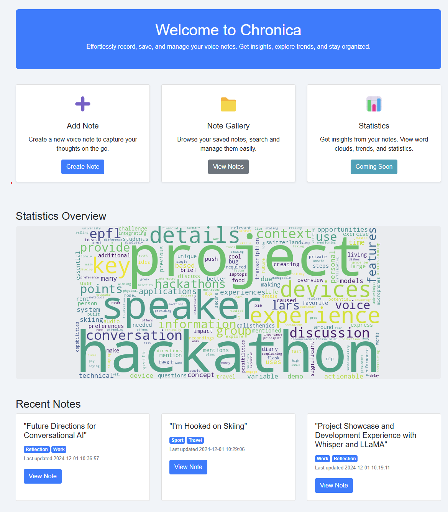
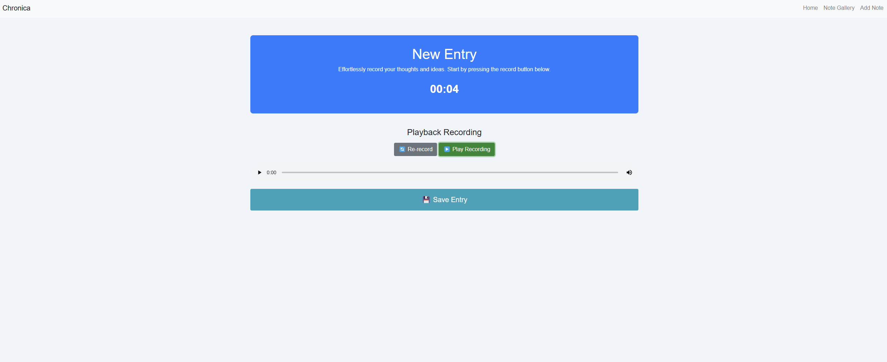
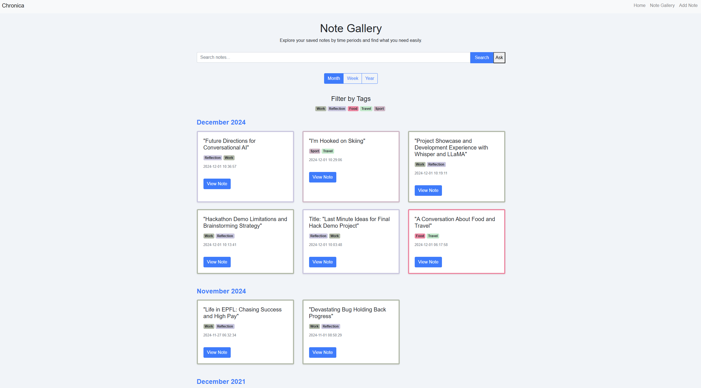
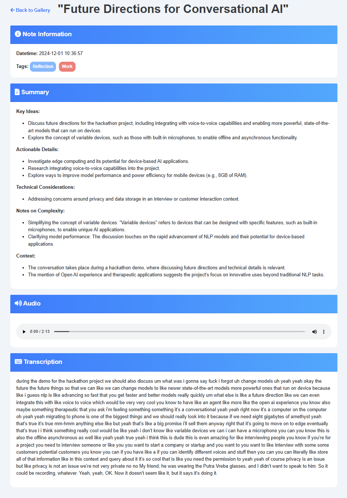

# Chronica


Chronica is a completely on-device Flask-based web application designed to help you create, manage, and visualize notes effectively and securely. It features an intuitive and interactive UI that allows you to log your unstructured thoughts, automatically transcribe and structure your notes, explore saved notes in a gallery, and even perform semantic searches and ask for insights about your entries.

## Features

- **Note Creation**: Record audio, transcribe it, and create new notes easily.
- **Note Gallery**: View your notes in a well-organized, visually appealing gallery, categorized by month, week, or year.
- **Semantic Search**: Search through your notes with advanced semantic matching.
- **Statistics Overview**: Visualize insights from your notes, such as word clouds of note summaries.
- **Beautiful and Interactive UI**: Colors are used to represent tags, and cards have dynamic effects to enhance the user experience.

## Screenshots

### 1. Home Page


### 2. Create a New Note


### 3. View Notes in the Gallery


### 4. View Note Entry


## Prerequisites

Ensure that you have the following installed on your machine:

- **Python 3.10.12**
- **pip** (Python package manager)
- **Docker**

## Installation

To set up and run Chronica locally, follow these steps:

1. **Clone the Repository**:

    ```sh
    git clone git@github.com:lars-quaedvlieg/chronica.git
    cd chronica
    ```

2. **Install Required Packages**:

    ```sh
    pip install -r requirements.txt
    sudo apt install portaudio19-dev
    ```

3. **[Install the Required CUDA Version](https://stackoverflow.com/questions/66977227/could-not-load-dynamic-library-libcudnn-so-8-when-running-tensorflow-on-ubun)**:

   ```sh
   wget https://developer.download.nvidia.com/compute/cuda/repos/ubuntu2004/x86_64/cuda-ubuntu2004.pin
   sudo mv cuda-ubuntu2004.pin /etc/apt/preferences.d/cuda-repository-pin-600
   export last_public_key=3bf863cc
   sudo apt-key adv --fetch-keys https://developer.download.nvidia.com/compute/cuda/repos/ubuntu2004/x86_64/${last_public_key}.pub
   sudo add-apt-repository "deb https://developer.download.nvidia.com/compute/cuda/repos/ubuntu2004/x86_64/ /"
   sudo apt-get update
   sudo apt-get install libcudnn8
   sudo apt-get install libcudnn8-dev
   ```

## Running the Application

After installing the dependencies, you can run the application using the following steps:

1. **Install Ollama** (Linux example):

    ```sh
    curl -fsSL https://ollama.com/install.sh | sh
    ```

2. **Pull the Docker Container for Qdrant**:

    ```sh
    docker pull qdrant/qdrant
    ```

3. **Run the Application**:

    Run `./run_docker.sh`
   
    In a seperate window, run `python run.py`
   
    Open your web browser and navigate to `http://127.0.0.1:5000` to use Chronica.

## Key Features and Usage

### 1. Creating New Notes
- Navigate to the **New Entry** page using the "Add Note" button on the homepage.
- Record audio using the big record button, and save the entry.
- Once saved, the entry will appear in the **Note Gallery**.

### 2. Viewing Notes in the Gallery
- Use the **Note Gallery** to browse through notes by selecting different time-based filters (month, week, year).
- Each card in the gallery represents a note, with its **tags** color-coded and its creation time displayed.

### 3. Semantic Search and Statistics
- Use the **search bar** to find relevant notes. The system uses **semantic search** to match queries with note content.
- You can also use the search bar to generate and extrapolate given the notes that you have created.
- You can also view a **statistics overview**, including a word cloud of note summaries.

## License

This project is licensed under the Creative Commons License. See the **LICENSE** file for details.

## Acknowledgments

- The **Flask** and **Bootstrap** frameworks were used to develop this application.
- Semantic search and audio transcription functionality use **Ollama** and other LLM models.

## Issues

If you encounter any issues while using the application, please create an issue.

